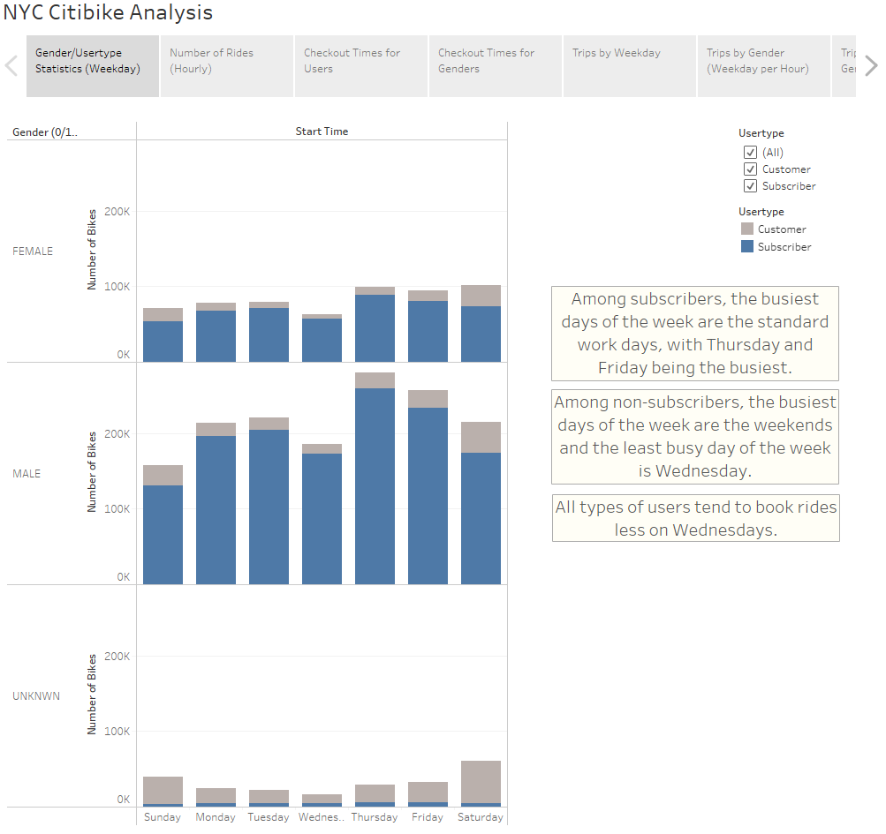
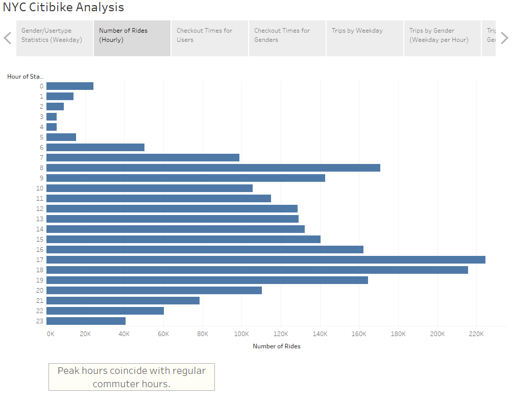
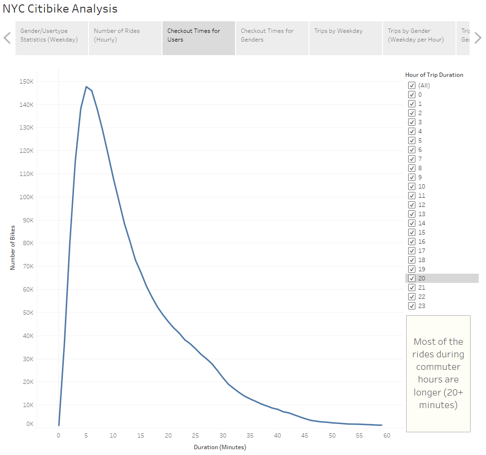
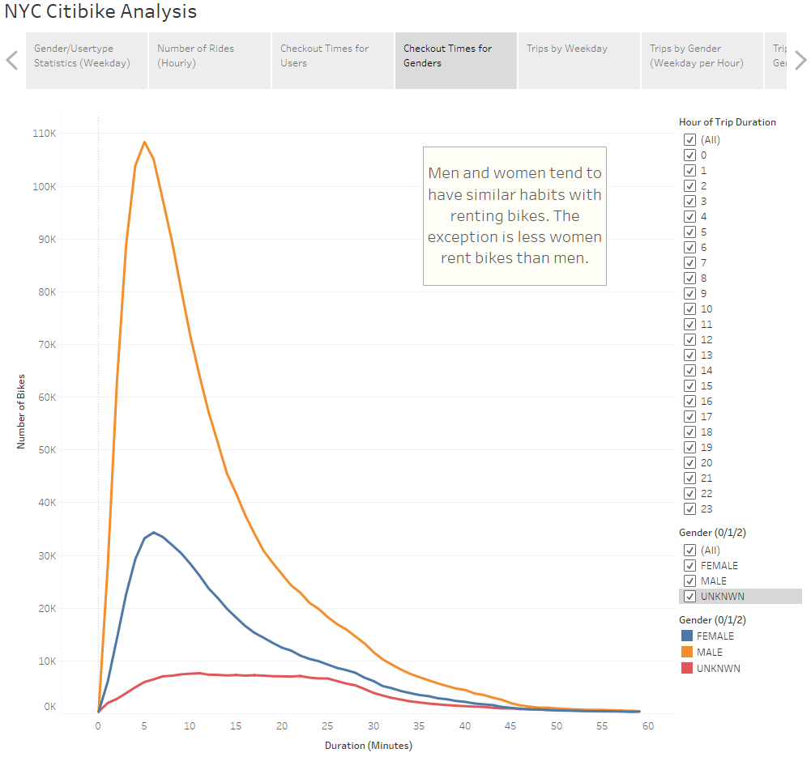
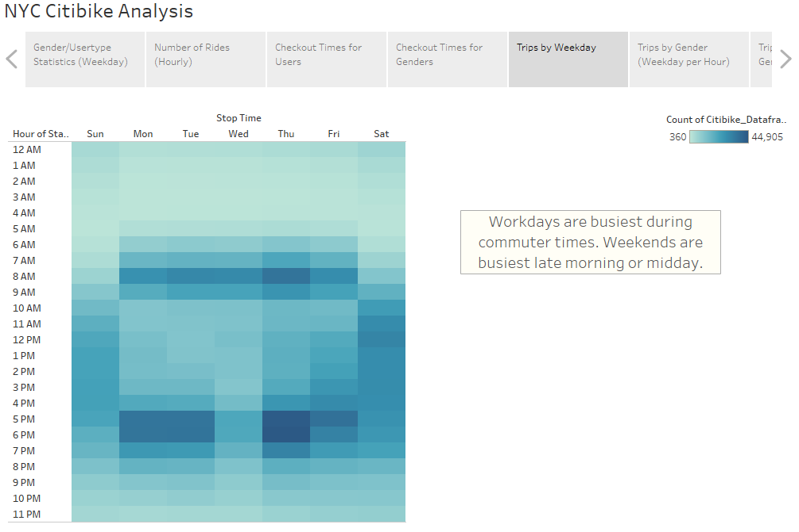
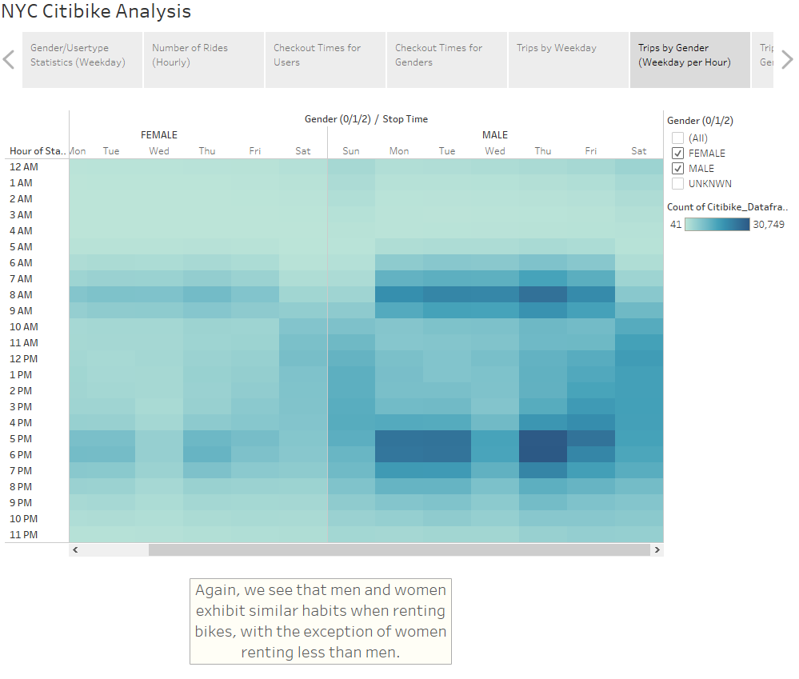
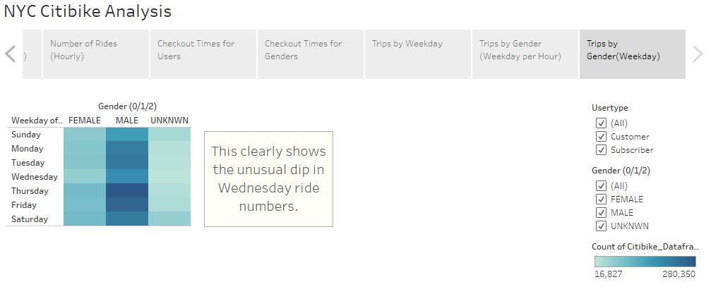

# Bikesharing
## Overview
This project used Tableau to map and display graphs representing August 2019 citibike data. The analysis was done to examine user statistics in 
New York City to create a model for expansion to another metropolitan area. The raw data file 201908-citibike-tripdata.csv.zip can be found here: 
https://s3.amazonaws.com/tripdata/index.html 
More information about the data can be found on the parent site: 
https://ride.citibikenyc.com/system-data 
## Results

This bar graph shows user demographics over total ride counts, separated by day of the week. The data indicate that a significant portion of 
subscribers are regular commuters. The non-subscribers tend toward weekend rides. Additionally, there seems to be an unusual lull in all user types 
and genders on Wednesdays. 

This graph shows the total ride counts, separated by hour of the day. Peak ride time coincides with regular commuter hours. The least busy times are 
early morning 2am-4am. 

This curve represents the average ride times. It seems that most rides are around five minutes or slightly longer. However, a quick look through 
commuter hours reveals longer ride times (twenty minutes or more). 

Here we see a similar curve, this time separated along gender lines. It seems that men and women use bikes for roughly the same period of time, on 
average. However, far fewer riders are female than are male. 

This heatmap is a representation of user density by hour, by day of the week. We see many bikes being used during commuter hours on weekdays. 
Weekends tend to see higher numbers during late morning or midday.  

An extension of the last graph, this one adds a filter by gender. Again, we see that rental behaviors are similar between men and women, but 
generally less riders are women. 

Another heat map, although with much less resolution. This represents user genders grouped by day of week. Most apparent here is the unusual dip in 
ride counts on Wednesdays. 
### Summary
Observations worth noting are the relatively low turnout of female users and the unusual dip in Wednesday rides. Additional analyses would be needed 
to investigate. Further comparisons could be made to see if all the Wednesdays in August showed low turnout or if there is an outlier that is 
skewing data. To explore female participation, the data at hand is rather limiting. However- the location information in the dataset could be used to 
see if geographical location is a factor. 
The full Tableau project can be found on Tableau Public: 
https://public.tableau.com/views/CitibikeAnalysis_16615746088060/GenderUsertypeStatisticsWeekday?:language=en-US&publish=yes&:display_count=n&:origin=viz_share_link
